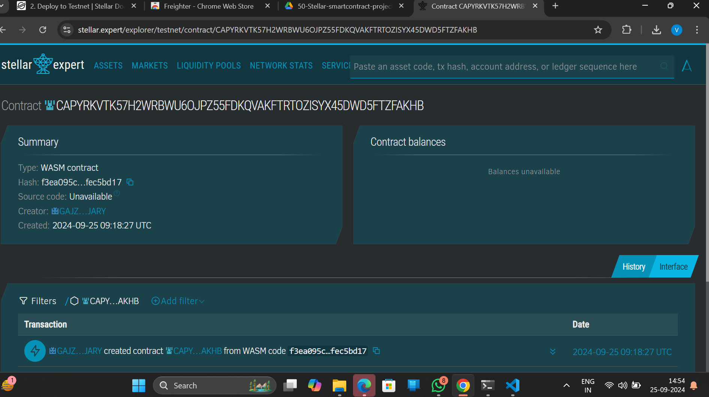

##### Deployed smartcontract address: CBQ3BPL3VVHPUUIEGIDXOIUQ6DGBDUZXHLSE4TIYSUTSXR4DP4PW2XQD

# Blockchain-based Carbon Offset Tracker

## Project Title
Blockchain-based Carbon Offset Tracker

## Project Description
This smart contract-based dApp allows businesses to track, buy, and sell carbon offset credits. Businesses can register carbon credits representing reduced emissions, and other businesses can purchase these credits to offset their carbon footprint. Transactions are securely managed through smart contracts on the blockchain, ensuring transparent and verifiable carbon credit exchanges.

## Project Vision
The vision of this project is to provide a transparent and decentralized marketplace for carbon credits, where businesses can contribute to reducing global carbon emissions by buying, selling, and tracking carbon offset credits. This platform aims to simplify the process of managing carbon credits while ensuring accountability and sustainability.

## Key Features
- **Register Carbon Credits**: Businesses can create carbon credits, representing their contributions to reducing emissions.
- **Buy and Transfer Carbon Credits**: Businesses can purchase carbon credits from other entities, transferring ownership securely through the smart contract.
- **Blockchain-based Transactions**: All transactions are handled on the blockchain, providing transparency, security, and immutability.
- **Tracking and Verification**: The system ensures that carbon credit transfers are verifiable and traceable, preventing fraud and double-counting of credits.
